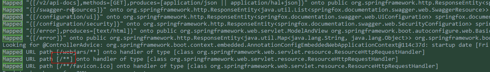
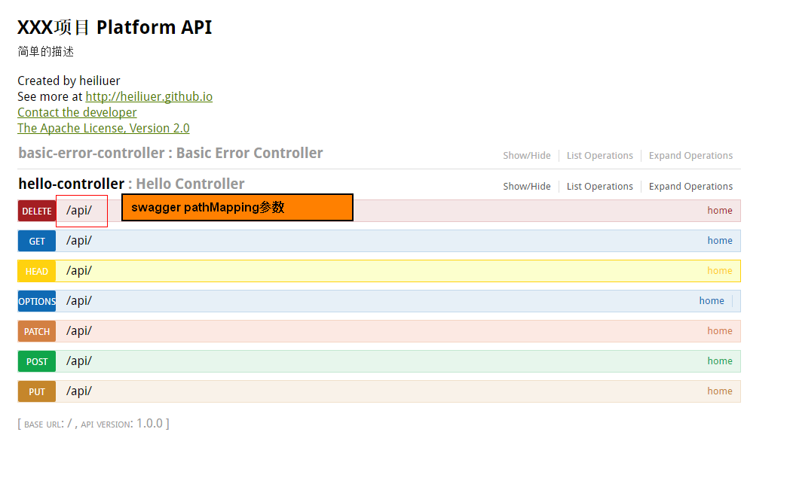

[参考文档](http://www.baeldung.com/swagger-2-documentation-for-spring-rest-api)


1. 配置swagger，生成api数据
    
    - spring-boot加入依赖即可

        ```
         <dependency>
              <groupId>io.springfox</groupId>
              <artifactId>springfox-swagger2</artifactId>
              <version>2.4.0</version>
         </dependency>
        ```
     
    - 非spring-boot 加入依赖，还需配置
    
        ```
        @Override
        public void addResourceHandlers(ResourceHandlerRegistry registry) {
            registry.addResourceHandler("swagger-ui.html")
              .addResourceLocations("classpath:/META-INF/resources/");
        
            registry.addResourceHandler("/webjars/**")
              .addResourceLocations("classpath:/META-INF/resources/webjars/");
        }    

        ```
        
    -  访问 http://localhost:8080/v2/api-docs 返回app所有api的json数据
    
2. 配置 swagger ui

    - 添加依赖
    
        ```
        <dependency>
            <groupId>io.springfox</groupId>
            <artifactId>springfox-swagger-ui</artifactId>
            <version>2.4.0</version>
        </dependency>
        ```
    - 启动app
        
        
    
    - swagger ui 会配置一个[/**]路由 ，将 swagger-ui.html 等指向swagger-ui jar中classpath://某些文件
    
        `Mapped URL path [/**] onto handler of type [class org.springframework.web.servlet.resource.ResourceHttpRequestHandler]`
    
    - 访问 http://localhost:8080/swagger-ui.html
        
        > `new Docket(DocumentationType.SWAGGER_2).pathMapping("api")`
        
        
    


